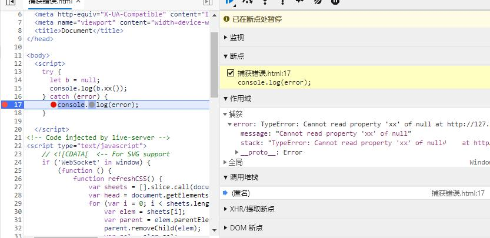
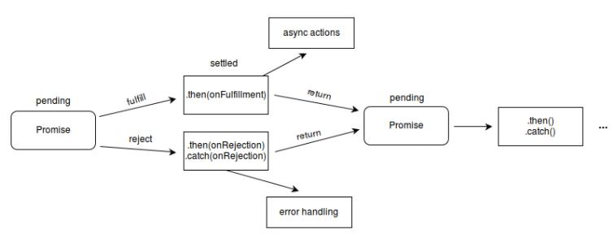
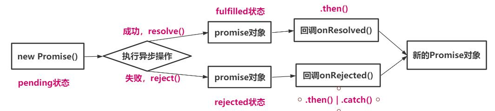
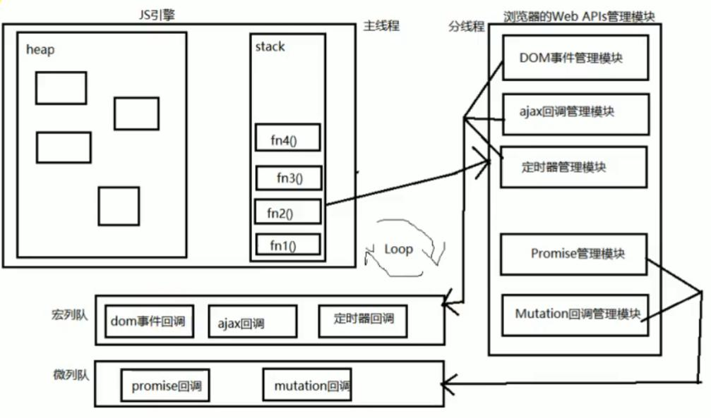

# [ES6核心特性](https://www.bookstack.cn/read/es6-3rd/sidebar.md)
+ [let和const命令](#let_const)
+ [数组的扩展](#array)
+ [Promise和async_await](#promise)
	- [什么是Promise](#whatpromise)
	- [为什么要用promise](#whypromise)
	- [怎么使用promise](#howpromise)
	- [JS异步宏队列和微队列](#callbackstack)
+ [解构赋值](#Destructuring)


### 项目的配置 babel webpack

<span id="let_const"></span>
## let 和 const
+ 旧的ES5只有全局作用域和函数作用域（函数内），可能导致：1、内层变量覆盖外层变量；2、变量泄露，成为全局变量。
+ 提供**`let`** **`const`**来表示块级作用域：有if和for等块级作用域，以前只有函数块
	- 变量作用域：变量子啊什么范围内是可用的
	- 块级作用域：代码块内
	- 闭包可以解决var变量泄露：是因为闭包函数是一个作用域
+ 使用**`let`**来避免循环体闭包问题
+ **`let`** **`const`**不可以重复声明变量
+ const修饰的标识符为常量，定义的时候必须赋值，一旦被赋值不可以再次赋值。（本质保存的是内存地址）
+ 常量的含义是指向的对象不能被修改，但是可以改变对象内部的属性
+ 建议：在ES6开发中，优先使用`const`，只有需要改变某一个标识符的时候再使用 `let`


## 对象的增强写法
+ 属性增强写法
	- ```js
		const name = 'z';
		const age = 18;
		let obj = {
			name,  //name:name
			age   //age:age
		}
	```
+ 方法的增强写法
	- ```js
		let obj = {
			// getName: function(){}
			getName(){}
		}
	```
<span id="array"></span>
## 数组的扩展
+ `Array.from()`：将伪数组对象或可遍历兑现转换为真数组
	- 如果一个对象的所有键名都是正整数或零，并且有length属性，则是伪数组。典型的有函数的`arguments`对象，大多数DOm元素集，还有字符串。
	- ```js
	let s = 'nihao'
	s.forEach(item=>console.log(item))
	<!-- Uncaught TypeError: s.forEach is not a function
	    at <anonymous>:1:3 -->
	Array.from(s).forEach(item=>console.log(item));
	<!-- Console换行打印：n i h a o -->
	```
+ `Array.of(v1,v2,v3)`：将一系列值转换成数组
	- 当调用`new Array()`构造器时，根据传入的参数类型和数量，会有不同的结果
	- `new Array(2)` 将数组长度属性设置为这个，数组没有赋值
	- `new Array(1,2,3)` 将这些参数作为数组的值来设置。
	- `Array.of`总会创建一个包含所有传入参数的数组，而不管参数的数量与类型。不存在由于参数不同导致的重载。
	- ```js
	let items = Array.of(1, 2);
	console.log(items.length); // 2
	console.log(items[0]); // 1
	console.log(items[1]); // 2
	items = Array.of(2);
	console.log(items.length); // 1
	console.log(items[0]); // 2
	```
+ 数组实例的`find()`和`findIndex()`
	- `find()`：找出第一个符合条件的数组成员，参数是一个回调函数，所有成员依次调用，直到找到返回true的成员，返回该成员。没有返回undefined。
	- ```js
	[1, 4, -5, 10].find((n) => n < 0)
	```
	- `findIndex()`：返回第一个符合条件的成员的索引。如果所有都不符合条件，返回-1。
	- ```js
	[1, 5, 10, 15].findIndex(function(value, index, arr) {
	  return value > 9;
	}) // 2
	```
+ 数组实例的`includes()`
	- 在此之前通常使用`indexOf()`检查是否包含某个值。缺点：1、不够语义化。找到参数值的第一个出现位置，所以要去比较是否不等于-1.
	- 2、内部使用严格的全等符号（===）进行判断，会导致对NaN的误判
	-``` 
	[NaN].indexOf(NaN) // -1
	[NaN].includes(NaN) // true
	```
	- `includes()`返回布尔值，表示某数组是否含有给定的值。第一个参数表示给定的寻找值；第二个参数表示搜索的起始位置，默认为0。如果是负数，表示倒着查询；如果这时（为负数的时候）大于了数组长度，则会重置为0。
	- ```js
	[1, 2, 3].includes(2)      // true
	[1, 2, 3].includes(4)      //false
	[1, 2, 3].includes(2, -1); // true
	[1, 2, 3].includes(2, -4); // true
	[1, 2, 3].includes(2, 1);  // true
	[1, 2, 3].includes(2, 4);  // flase
	```
+ 数组实例的`entries()` `keys()` `values()`
	- 都是用来遍历数组，都返回一个遍历器对象，可用 `for...of`来进行遍历
	- 区别：`entries()`对键值对遍历；`keys()`对键名遍历；`values()`对键值遍历。
	- ```js
	for (let index of ['a', 'b'].keys()) {
	  console.log(index);
	}
	// 0
	// 1
	for (let elem of ['a', 'b'].values()) {
	  console.log(elem);
	}
	// a
	// b
	for (let [index, elem] of ['a', 'b'].entries()) {
	  console.log(index, elem);
	}
	// 0 "a"
	// 1 "b"
	```
## 数组高阶函数的使用 filter过滤 map映射 reduce
+ ```js
		const nums = [12, 20, 300, 94, 399, 100, 40, 50]
		// 需求：1、取出所有小于100的数 2、将这些数全部转化为2倍 3、然后把转化后的所有数加起来
		// filter/map/reduce

		// filter 遍历数组，并且经过操作，返回过滤后的原数组
		// filter中的回调函数：必须返回一个boolean值
		// true：函数内部会自动将这次回调的n加入到新的数组中去
		// false：函数内部会过滤掉这次的n
		let newNums = nums.filter(n => {
		  return n < 100
		})
		console.log(newNums);  // [12, 20, 94, 40, 50]

		// map 将数组中每一个元素进行某种操作。然后返回这个新的数组
		let newNums2 = newNums.map(n => {
		  return n * 2
		})
		console.log(newNums2);  // [24, 40, 188, 80, 100]

		// reduce 作用对数组中所有的内容进行汇总 
		// 参数1：回调函数。  参数2： 初始值
		// preValue: 上一次的返回值   每一次遍历值
		let total = newNums2.reduce((preValue, n) => {
		  return preValue + n
		}, 0)
		// 第一次： preValue：0  n：24
		// 第二次： preValue：0+20  n：40
		// 第三次： preValue：0+20+40  n：188
		// 第四次： preValue：0+20+40+188  n：80
		// 第四次： preValue：0+20+40+188+80  n：100   这里就return 0+20+40+188+80+100
		console.log(total);   // 432

		// 高阶使用
		let Total = nums.filter(n => n < 100)
		.map(n => n * 2)
		.reduce((pre, n) => pre + n, 0)
		console.log(Total);   // 432
	```

<span id="promise"></span>	
## Promise
## async/await
+ JS是单线程的--》要插入任务或者事件，就需要异步来实现--》而异步就需要事件轮询--》事件轮询核心就是回调函数
+ 异步方法进入调用栈(call stack)-->发现是异步任务，将异步标志和回调函数放入到异步线程中(web apis)，进行运行。-->宏线程（调用栈）中抽离这个方法，进入到下面的方法
+ 在web apis 中当异步任务完成时，将这个回调函数放到事件队列中(callback queue)中-->此时，由事件轮询(event loop)(JS中不断看是否有事件进行)来将这个回调函数放到调用栈中进行执行
+ **事件轮询**：当主线程为空的时候，就会去事件队列中去看是否有事件需要执行，没有就回到空线程。有就将其推入主线程中进行执行。
+ **回调函数**：作为某个函数参数的函数就是回调函数。某个函数称为高阶函数。
	- 不是所有的回调函数都是用于异步的。有异步回调函数，也有同步回调函数（例如```arr.sort((a,b)=>a>b```)）

+ PROMISE 特性：
	- 状态（pending 进行中， fulfilled 已完成 rejected 已失败）
	- 1.状态不受外界影响。2.固化：一旦状态固定，不可更改。
	- 宏队列--》微任务队列（promise中进入微任务队列）--》异步队列
+ thenable对象：里面有一个then() function
	- ``` 
	then(resolve,reject){
		resolve()
		//reject()
		}
		```
	- ``` Promise.resolve(thenable Object) ```  会默认调用then方法的状态
	- .reject用不了（会打印出对象--{then: f}）
+ 小试题：
	```js
	//微队列 异步队列
		Promise.resolve().then(() => {
		  console.log('promise1');
		  setTimeout(() => {
			console.log('setTimeout2');
		  }, 0)
		})
		console.log('main');
		setTimeout(() => {
		  console.log('setTimeout1');
		  Promise.resolve().then(() => {
			console.log('promise2');
		  })
		}, 0)
		// 查看主线程中是否有任务，打印main 没有了
		// 事件轮询事件队列。
		// 第一个promise进入微任务队列（事件队列），接着往下，setTimeout将回调函数放入WebApi异步队列中。
		// 执行一个promise的then里面的回调函数，打印promise1。接着，setTimeout将回调函数放入异步队列中。
		// 在异步队列中，先放入的setTimeout时间到了，将内容放到事件队列供事件轮询
		// 事件轮询，打印setTimeout1。接着promise进入微队列，微队列先于异步队列。所以接着打印promise2。
		// 接着打印setTimeout2
		// main
		// promise1
		// setTimeout1 
		// promise2
		// setTimeout2
	```
	
	```js
		const promise = new Promise((resolve,reject)=>{
	      console.log("excutor1");
	      resolve('resolved');
	    })
	    console.log("main1");
	    promise.then(value=>console.log(value))
	    console.log("main2");
	    console.log("main2");
	    console.log("main2");
	    console.log("main2");
	    console.log("main2");
	    // promise对象的执行器是同步回调，所以会先执行excutor1
	    // 在主线程中执行main1
	    // 遇到执行异步回调，放到微队列，
	    // 接着主线程执行main2.。。。。主线程没有任务了
	    // 事件轮询，执行微队列中的resolved
	```
+ 链式调用

## Promise从入门到自定义
+ **准备**：
	- 函数对象和实例对象
		- 函数对象：将函数作为对象使用时，称为函数对象
		- 实例对象：new 函数产生的对象，简称为对象。
		- `()`左边是方法，`.`左边是对象
	- 两种回调函数：（回调函数：1、你定义的。2、我没有亲自调用。3、但是最后执行了。4、作为函数参数的函数）
		- 同步回调：立即执行，完全执行完了才结束，不会放入回调队列中。
			- 例子：数组遍历相关的回调函数 / 排序的sort / **promise的excutor函数**(执行器函数：(resolve,rejected)=>{})
		- 异步回调：不会立即执行，会放入回调队列中将来执行。
			- 例子：定时器回调 / ajax回调 / Promise的成功|失败的回调
		- 判断小技巧：在需要判断的任务后面写一个输出，来查看输出结果判断。
	- [JS的error处理](https://developer.mozilla.org/zh-CN/docs/Web/JavaScript/Reference/Global_Objects/Error)
		- 错误类型（一些）
			- Error：所有错误的父类型
			- ReferenceError：引用的变量不存在
			- TypeError：数据类型不正确的错误
			- RangeError：数据值不在其所允许的范围内（如递归调用没有限制就会有这个错误）
			- SyntaxError：语法错误
		- 错误处理（出错不处理程序无法向下执行）
			- 捕获错误：try{}catch(error){}   //系统捕获
			- 抛出错误：throw error   //自定义抛出错误，由调用者处理（还是try...catch）
			- 
		- 错误对象
			- message属性：错误相关信息
			- stack属性：函数调用栈记录信息
			- Error里面有message和stack如上图中断点捕获的error

<span id="whatpromise"></span>
+ **Promise是什么？** promise承诺，承诺之后做出什么事
	- 理解
		- 抽象：JS中进行异步编程的新的解决方案（旧的是纯回调形式）
		- 具体：(1) 从语法上讲：promise是一个构造函数（实例去做事） (2)从功能上讲：promise对象用来封装一个异步操作并可以获取其结果
	- 状态改变
		- 
		- pending(待定) | fulfilled(已兑现) | rejected(已拒绝)
		- 状态改变：1.pending --> fulfilled 2.pending --> rejected
			- 只有这两种情况，且一个promise对象只能改变一次（固化）
			- 无论哪种，都会有结果数据。成功的为value，失败的一般成为reason
	- 基本流程
		- 
	- 基本使用
		- ```js
		new Promise((resolve,reject)=>{
			
		}).then(onResolved(),onRejected())
		```

<span id="whypromise"></span>
+ **为什么要用Promise？**
	- 指定回调函数的方式更加灵活
		- 旧的：必须在启动异步任务前指定
		- promise：启动异步任务 => 返回promise对象 => 给promise对象绑定回调函数(甚至可以在异步完成之后绑定)
	- 支持链式调用，可以解决回调地狱
		- 回调地狱：回调函数嵌套使用，外部回调函数异步执行的结果是内部回调函数异步执行的条件
		- 缺点：不方便阅读维护 / 对于错误的捕获不好处理（promise最后捕获错误：错误**传透**）
		- 解决方案： promise链式调用。（在于每个.then()会返回一个新的promise）（但是还是有回调函数）
		- 终极解决：async / await  （编译后还是回调）
<span id="howpromise"></span>
+ **如何使用Promise？**
	- [常用的API说明](https://developer.mozilla.org/zh-CN/docs/Web/JavaScript/Reference/Global_Objects/Promise)
		- Promise构造函数：Promise(excutor){}
			- excutor函数：同步执行 (resolve,reject)=>{}
			- resolve函数：内部定义成功时我们调用的函数 
			- reject函数：内部定义失败时我们调用的函数 
			- 说明：excutor 会在Promise内部立即同步回调，异步操作在执行器中执行	
		- Promise.prototype.then() : (onResolved,onRejected)=>{} .then()是同步执行，里面的回调函数是异步执行
			- onResolved ：成功的回调函数 value=>{} 
			- onRejected ：失败的回调函数 reson=>{}
			- 说明：会返回一个新的Promise对象
		- Promise.prototype.catch() : (onRejected)=>{}
			- onRejected ： 失败的回调函数 reson=>{}
			- 说明：.then()的语法糖，相当于：.then(undefined,onRejected)
		- Promise.resolve() : value => {}
			- value：数据或promise对象或者thenable对象
			- 说明：返回一个成功/失败的promise对象
		- Promise.rejected() : reason => {}
			- reason：失败的原因
			- 说明：返回一个失败的promise对象
		- Promise.all([p1,p2,p3]) : promise=>{}
			- promise:包含n个promise的数组
			- 说明：返回一个新的promise，只有所有的promise都成功才成功，有一个失败就直接失败
		- Promise.race([p1,p2,p3]) : promise=>{}
			- promise:包含n个promise的数组
			- 说明：返回一个新的promise，第一个完成的promise(不是放在第一个的)结果状态就是最终的结果状态
	- 几个关键问题
		1. 如何改变Promise状态？
			- resolve(value): 状态由pending变成fulfilled
			- reject(reason): 状态由pending变成rejected
			- 抛出异常throw new Error()：状态由pending变成rejected
		2. 一个promise指定多个成功/失败回调函数，都会调用？
			- 只要promise处于对应状态，会调用所有对应的回调函数
		3. 改变promise状态和指定回调函数谁先谁后？
			- 都有可能，正常情况下是先指定回调函数再改状态（指定数据），也有先改状态（指定数据）再指定回调函数
			- 如何先改状态再指定回调？
				- 在执行器中直接调用回调函数resolve()/reject()
				- 延迟更长时间才调用.then()
		4. promise.then()返回的新的promise对象结果状态由什么决定？
			- 简单表达：由.then()指定的回调函数执行的结果决定
			- 详细表达：
				- 如果抛出异常，新promise变为rejected，reason为抛出的异常
				- 如果返回的是非promise的任意值，新的promise变为fulfilled状态，value为返回的值
				- 如果返回的是另一个新的promise，此promise结果就是新promise的结果
		5. promise如何串联多个操作任务？
			- promise.then()返回一个新的promise，可以看成.then()的链式调用
			- 通过then的链式调用串联多个同步/异步任务（封装成promise）
		6. promise异常传透？
			- 当使用promise.then链式调用，可以在最后指定失败的回调
				- 中间不写，实际上是：throw reason；
			- 前面任何操作出了异常，都会传到最后失败的回调中处理
		7. 中断promise链？- 当使用promise.then()链式调用，在中间中断，不再调用后面的回调函数
			- 办法：在回调函数中返回一个pending状态的promise对象
+ **自定义(手写)Promise**
+ [async](https://developer.mozilla.org/zh-CN/docs/Web/JavaScript/Reference/Statements/async_function) [await](https://developer.mozilla.org/zh-CN/docs/Web/JavaScript/Reference/Operators/await)
	- async函数 
		- 函数的返回值为promise对象
		- promise对象的结果由async函数执行的返回值决定
	- await表达式
		- 右侧的表达式一般为promise对象，但也可以是其他值
		- 如果是promise对象，await返回的是promise成功的结果。失败的结果需要使用try{}...catch(){}
		- 如果是其他值，直接将此值作为await的返回值
	- 注意：
		- await必须卸载async函数中，但是async函数不一定由await
		- 如果await的promise失败了，就会抛出异常，通过try...catch来捕获处理
<span id="callbackstack"></span>
+ **JS异步宏队列和微队列**
	+ 
	+ 宏队列：用来保存待执行的宏任务（回调），比如：定时器回调/DOM时间的回调/ajax回调
	+ 微队列：用来保存待执行的微任务（回调），比如：promise回调/MutationObserver回调（标签属性改变）
	+ JS单线程：先执行所有的同步代码，执行完后。再去队列执行：先按顺序执行微队列，执行完后。再去宏队列按顺序执行，同时会轮询微队列是否有新任务，有就去微队列执行完了再回来执行宏队列
		- JS引擎首先必须执行所有的初始化同步任务代码
		- 每次准备取出第一个宏任务执行之前，都要将所有的微任务一个一个取出来执行
	+ 测试题目
	+ ```js
		const first = ()=>(new Promise((resolve,reject)=>{
		  console.log(3)
		  let p = new Promise((resolve,reject)=>{
			console.log(7)
			setTimeout(()=>{
			  console.log(5)
			  resolve(6)
			  // 这里面的resolve是在宏队列里面，由于会先执行外面的微队列。状态已经改变，所以这个没有用
			},0)
			resolve(1)  
		  })
		  resolve(2)
		  p.then(value=>{
			console.log(value);
		  })
		}))
		first().then(value=>{
		  console.log(value)
		})
		console.log(4)
		// 3
		// 7
		// 4
		// 1
		// 2
		// 5
	```
	```js
		setTimeout(()=>{
		  console.log('0')
		},0)
		new Promise((resolve,reject)=>{
		  console.log('1')
		  resolve()
		}).then(()=>{
		  console.log('2')
		  new Promise((resolve,reject)=>{
			console.log('3')
			resolve()
		  }).then(()=>{
			console.log('4')
		  }).then(()=>{
			console.log('5')
		  })
		}).then(()=>{
		  console.log('6')
		})
		new Promise((resolve,reject)=>{
		  console.log('7')
		  resolve()
		}).then(()=>{
		  console.log('8') 
		})
		// 1
		// 7
		// 2
		// 3
		// 8
		// 4
		// 6
		// 5
		// 0
	```
  
## 箭头函数

<span id="Destructuring"></span>
## 解构赋值
解构赋值的规则是，只要等号右边的值不是对象或数组，就先将其转为对象。undefined和null不能转为对象，所以会出错
+ 数组解构赋值：数组的元素是按次序排列的，变量的取值由它的位置决定
	- ```js
		let [foo, [[bar], baz]] = [1, [[2], 3]];
		foo // 1
		bar // 2
		baz // 3
	```
+ 对象解构赋值：对象的属性没有次序，变量必须与属性同名，才能取到正确的值
	- 可以将一个对象的方面很好的赋值给另一个对象。下面代码，将console.log赋值到log变量
		- ```js
			const { log } = console;
			log('hello') // hello
			
			const name = 'nihao';
			let {name}
			//name:'nihao'
		```
	- 实际上，对象的解构赋值是下面形式的简写。也就是说，对象的解构赋值的内部机制，是先找到同名属性，然后再赋给对应的变量。真正被赋值的是后者，而不是前者。
		- ```js
			let { foo: foo, bar: bar } = { foo: 'aaa', bar: 'bbb' };
		```
	- 下面代码中，foo是匹配的模式，baz才是变量。真正被赋值的是变量baz，而不是模式foo。
		- ```js	
			let { foo: baz } = { foo: 'aaa', bar: 'bbb' };
			baz // "aaa"
			foo // error: foo is not defined	
		```
+ 字符串解构赋值：字符串会先转化为类似数组的对象
	- ```js
		const [a, b, c, d, e] = 'hello';
		a // "h"
		b // "e"
		c // "l"
		d // "l"
		e // "o"
		let {length : len} = 'hello';
		len // 5
	```
+ 数值和布尔值的解构赋值：先转化为对象
+ 函数参数解构赋值
+ 用途
	- 交换变量值
	- 从函数返回多个值
	- 函数参数的定义
	- 提取JSON数据
	- 函数参数的默认值：ES6以上在方法中给形参设置一个默认值为function(date=''){}，可以防止无实参传入的效果
	- 遍历Map解构
	- 输入模块的指定方法
	
## 字符串新增的方法
+ 已有的
	- A.length  返回字符串的长度  
	- A.indexOf('a')  在A中是否a字符串 存在返回首次出现的位置，不存在返回-1 空字符串返回0 
	- A.slice(0,3)  截取字符串从0到3位置的字符串。A.slice(2) 截取从2到末尾    
	- A.toUpperCase() 全部转换为大写字母  
	- A.toLowerCase()  全部转换为小写字母 
	- A.replace('a','b')  替换a为b  前面除了能写字符串 还可以定义正则
	- replace(/a/g,b'')   ---- 将全部a替换成b
## 默认形参
## 函数扩展

## 字符串的扩展
+ 为字符串添加了遍历器接口，可以使用for of进行遍历
+ 模板字符串 `` -- 可以换行，也可以解析变量
## 导入导出import export
## class关键字：实现面向对象编程（语法糖）
