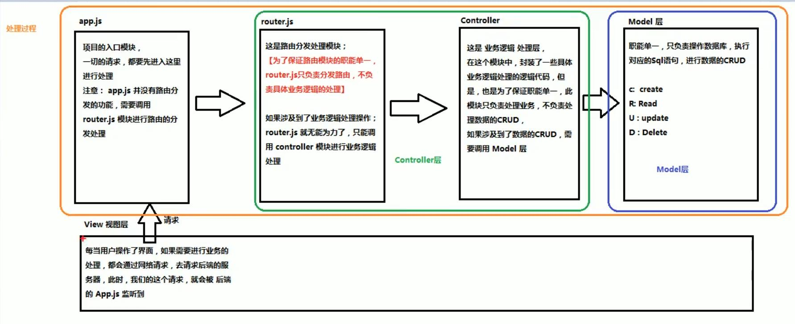
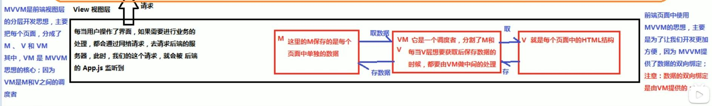
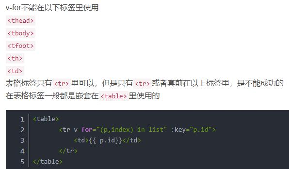
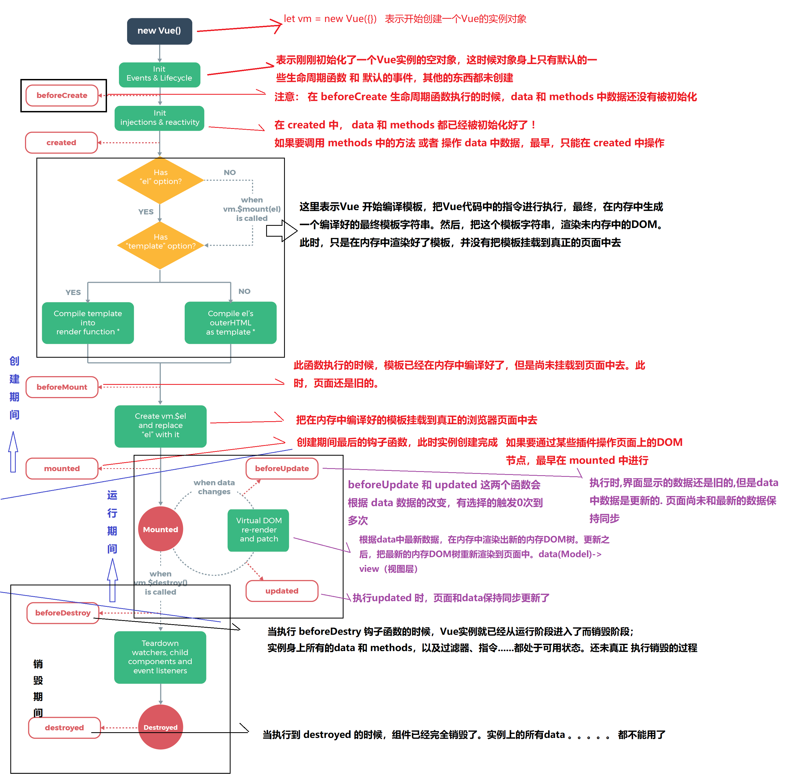

## vue.js优点    视图+脚本
* 体积小
* 更高的运行效率  
* 双向数据绑定  
* 生态丰富、学习成本低

## （后端）MVC与（前端）MVVM	
+ 后端MVC	MODEL-VIEW-CONTROLLER
	- 	
+ 前端MVVM  Model-View-ViewModel
	- 


# 指令集
## 指令引号中是一个变量名，会到Vue中data寻找。如果需要传入字符串 需要添加引号
+ v-cloak 解决插值表达式的闪烁问题//或者使用v-text就默认没有闪烁问题--但是会覆盖原本的内容，与插值表达式的不同
+ v-html  用来渲染html，也会覆盖原有内容
+ v-bind（缩写为：） 用来绑定属性的一个指令，用于告诉属性后面的引用是一个表达式
+ v-on (缩写为@) 用来绑定事件，为元素指定处理函数的时候，如果加了括号，可以传参
 + 事件修饰符： ------- 可以串联，要注意串联顺序，导致修饰符的效果（注意once）
	- .stop ---------- 阻止事件冒泡（往外层触发）
	- .prevent ---------- 阻止默认行为
	- .capture --------- 实现捕获触发事件机制（默认冒泡的 从内往外）
	- .self --------- 实现事件只有在元素本身触发时才调用（阻止当前元素的冒泡）
	- .once -------- 事件默认只触发一次（once比较特殊）
+ v-model **唯一一个实现数据双向绑定的指令**，*其他是单向绑定，从M自动绑定到V*。注意：该指令只能运用在**表单元素**中
+ v-bind:   绑定class和绑定内联样式
+ v-for 实现列表循环渲染。v-for="item of list"(也可以用in，但是用of更符合javascript迭代器语法)
 - in 后面可以放：普通数组（item，index），对象数组（obj，index），对象（val,key,index），数字（数字从1开始迭代）
 - 在组件中，使用v-for循环的时候，或者在一些特殊情况下，指定唯一的 字符串/数字 类型 :key值。
 - 
+  v-if 当为真时，显示。每次都会重新删除或者重新创建元素  v-else 为假时显示
+  v-show  当为真时，显示。第一次创建元素，之后不会删除元素。只是切换了元素的 display:none 样式
 - v-if 有较高的切换性能消耗（惰性的：直到当条件为真，才渲染，当为假，就删除。这是切换消耗）；
 - v-show 有较高的初始渲染消耗（不管第一次条件都会渲染。只是切换 dispaly:none 样式）


## 过滤器  ---vue允许自定义过滤器，可被用于常见文本的格式化（时间..）只能用在插值表达式和v-bind表达式中，使用管道调用。可多次调用多个过滤器
 + 全局过滤器：每个Vue实例都可以使用（先过滤器再Vue实例）
	- ```
	Vue.filter('过滤器名称',function(data){})
	``` 
	- function中的第一个参数永远是管道符前面传过来的参数，还可以传参进来
	- {{ name | 过滤器名字 }}
 + 定义私有过滤器（局部）
	- Vue实例中的`filters`属性（对象）
	- ```
	filters:{
		过滤器名称:function(){
			。。。。。。。。。。
		}
	}
	```
	- 如果全局过滤器和私有过滤器重名，就近原则调用--私有过滤器
	

## ES6以上在方法中给形参设置一个默认值为function(date=''){}，可以防止无实参传入的效果。

## 自定义指令 
+ 使用：`Vue.directive()` 定义全局指令
	- 参数1：指令名称。定义的时候，名称前不需要加`v-` 。但是调用的时候必须在指令名称前加上```v-```前缀调用。
	- 参数2：是一个对象，对象上，有一些指令相关的钩子函数。这些函数可以在特定阶段，执行相关操作。
		- 钩子函数： `bind` `inserted` `update` `componentUpdated` `unbind`
		- 钩子函数上的参数：el，binding，vnode，oldVnode
			- `el` 表示被绑定指令的元素
			- `binding` 对象：name：不带v-的指令名字；value：会被计算的值；expression：字符串形式的指令表达式。（还有一些其他的属性）
+  定义私有指令：
	- Vue实例中的`directives`属性
	- 
	``` js
	 directives: { 
        'fontweight': {
          bind: function (el, binding) { 
            el.style.fontWeight = binding.value;
          }
        }
      }
	```
	- 简写:当需要在bind和update里面都写这个方法的时候
	``` js
	'fontsize':function(el,binding){  //（简写）这个相当于在bind和update里面都写了这个方法
		el.style.fontSize = parseInt(binding.value)+'px';   //防止没有加px
	 }
	```
		
## Vue实例的生命周期
### 生命周期：从Vue实例创建、运行、到销毁期间，总是伴随着各种事件，这些事件统称为生命周期
### 生命周期钩子=生命周期函数=生命周期事件
+ 创建期间的钩子函数： `beforeCreate` `created` `beforeMount` `mounted` 
+ 运行期间的钩子函数： `beforeUpdate` `updated`
+ 销毁期间的钩子函数： `beforedestroy` `destroyed`

	
	
## 动画过渡
+ `transition`的属性：`tag`指定要渲染的元素，默认为span  `name`自定义v-前缀 `mode`设置组件切换时候的模式
+ 自定义实现
 - 第一步：使用`<transition>`包裹起来  如果v-for(设置key属性)循环的列表 使用`<transition-group>`
 - 第二步：在`<style>`里面使用样式
+ 第三方Animate.css
+ JavaScript钩子实现半场动画（反复的 进入或者是 反复的离场）
	```js
	<transition
	  v-on:before-enter="beforeEnter"   
	  v-on:enter="enter"
	  v-on:after-enter="afterEnter"
	  v-on:enter-cancelled="enterCancelled"
	
	  v-on:before-leave="beforeLeave"
	  v-on:leave="leave"
	  v-on:after-leave="afterLeave"
	  v-on:leave-cancelled="leaveCancelled"
	>
	  <!-- ... -->
	</transition>
	```
+ 实现多个组件过渡
	- ```js
	<!-- 使用transition包裹实现组件模板切换动画过渡 -->
	    <!-- out-in 是解决就组件消失和新组件出现同步的问题.这样就是等组件消失完才慢慢出现 -->
	    <transition  mode="out-in">  
	      <component :is="comName"></component>
	    </transition>
	```
 
 
 ## 组件：为了拆分Vue实例的代码量，以不同组件划分功能模块
 + 模块化和组件化区别：
	- 模块化：从代码逻辑角度划分的。方便代码分层开发，保证每个模块功能单一
	- 组件化：从UI界面角度划分的；方便前端组件的复用	
 + 创建组件（全局注册） 
	- ```js
		// 1.1 使用Vue.extend 来创建全局的Vue组件
	    let com1 = Vue.extend({
	      template: '<h3>组件模板1</h3>'
	    })
	    // 1.2 使用Vue.component('组件名',组件模板对象)
	    // 组件名使用短横线分割命名或者驼峰法命名.但是引用的时候只有短横线分隔命名有效
	    // 注意在html中标签只有小写 所以最好只用小写命名即可 'mycom1'
	    Vue.component('my-com1', com1);
	```
	- 简化1
	```js
	Vue.component('mycom1', Vue.extend({
	      template: '<h3>组件模板1</h3>'
	    }))
	```
	- 简化2 模板只能有一个根元素（用div包裹一下即可）
	```js
	Vue.component('mycom1', {
	      template: '<h3>组件模板1</h3>'
	    })
	```
	- 另外一种:在被控制的div之外使用标签`template`来创建组件模板结构
	```js
	<template id="temp1">
	    <div>
	      <h3>这是在被控制的appdiv之外使用template标签创建的一个组件模板结构</h3>
	      <h3>好用,不错,有提示</h3>
	    </div>
	  </template>
	```
	```js
	Vue.component('mycom1',{
	      template:"#temp1"
	    })
	```
	
+ 私有组件注册
	- 使用Vue实例的`components`属性	
	```js
	components:{
		login:{
			template:"#temp1"
		}
	}
	```
+ 组件中的data和methods
	- 组件中的data 是一个返回对象的方法。其中的数据使用方法和vm实例中的使用方式一致
	- methods 是一个对象

+ 组件切换
	- 1、两个切换：使用v-if v-else切换
	- 2、多切换：Vue提供了`component`组件，来展示对应名称的组件，通过:is接收组件模板名称（字符串）（或者以变量形式来给与）
	```js
	<component :is="comName"></component>
	```
+ Vue提供html中的标签
 - `component` `template` `transition`  `transition-group`
 
 
## 计算属性缓存vs方法	
* 计算属性是基于**响应式依赖**进行缓存的。只在相关响应式依赖发生改变时它们才会重新求值。这意味着就算多次求值，
 如果依赖没有发生改变，那么会立即返回上一次的计算结果，而不必再次执行函数。
* 相比之下，每当触发重新渲染时，调用方法将**总会再次执行函数**。
* 为什么需要缓存？加入一个计算属性依赖于另外一个计算属性。如果没有缓存，我们将多次执行。

## 动态参数约束
* 使用的时候最好使用小写字母来命名，因为浏览器会把attribute名强制转换成小写	

