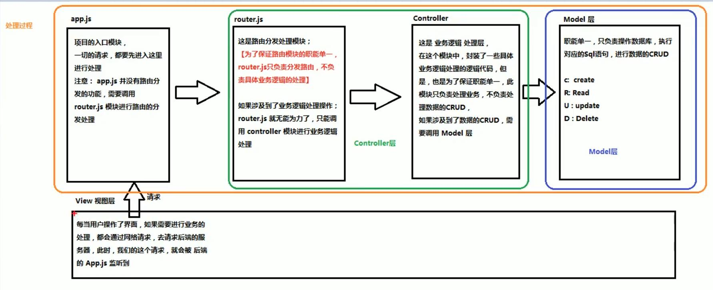
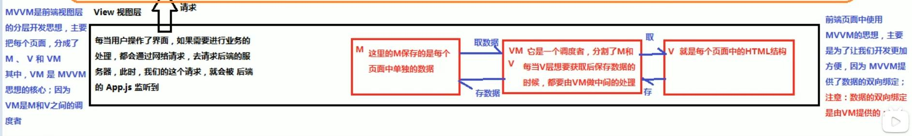
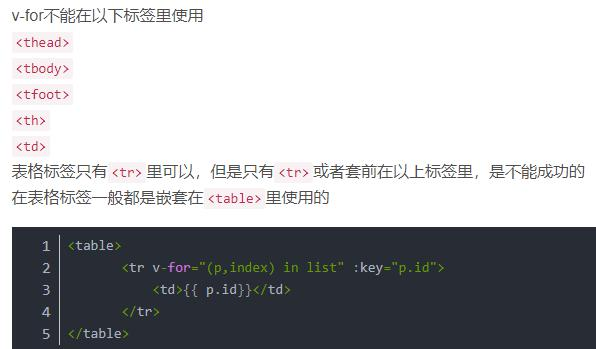
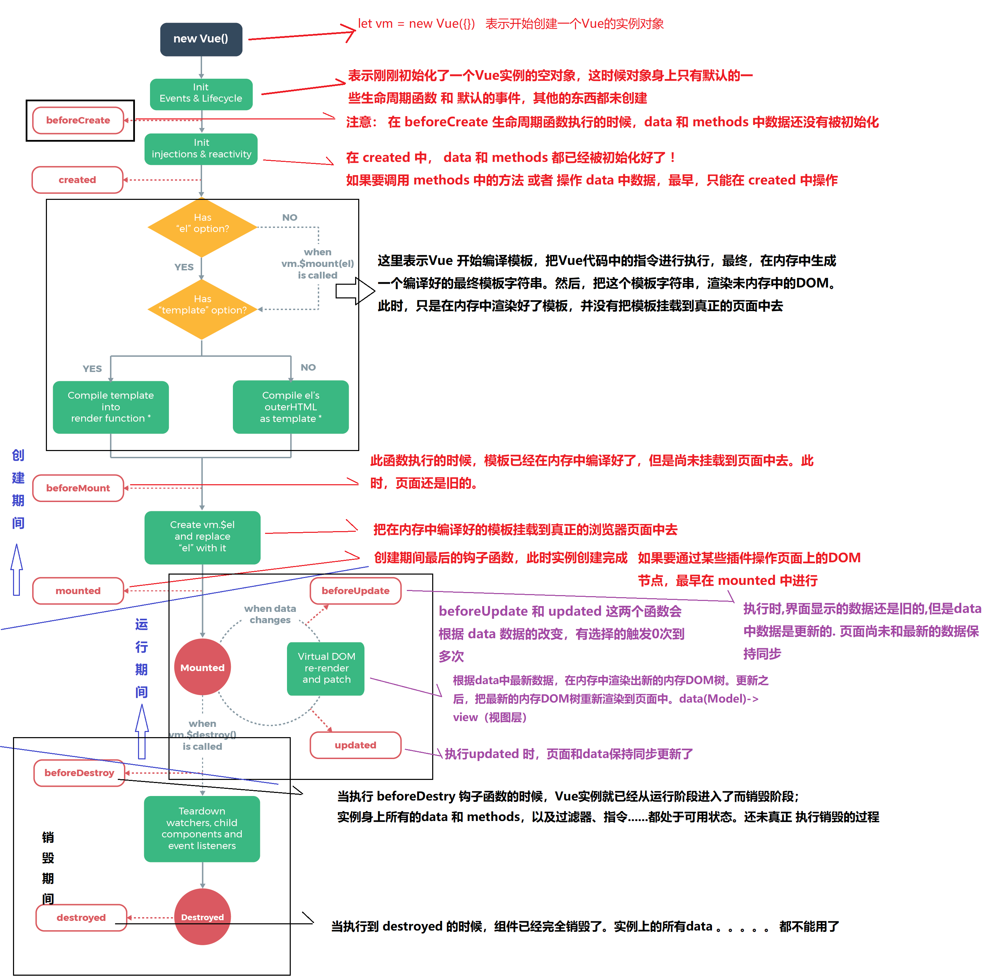
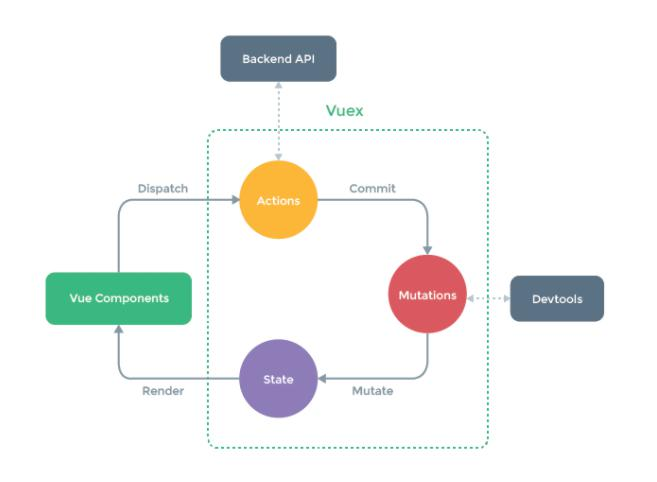

|[vue优点](#vue优点)	|[MVVM与MVC](#mvvm)|[指令集](#codes)	|
|-- |--	|--	|
|[过滤器](#filters)	|[自定义指令](#personalcodes)	|[Vue生命周期](#lifecycle)		|
|[动画过渡](#动画过渡)	|[组件化](#component)	|	[路由](#router)|
|	[计算属性](#computed)|	|	|


<span id="vue优点"></span>
## vue.js优点    视图+脚本
* 体积小
* 更高的运行效率  
* 双向数据绑定  
* 生态丰富、学习成本低


## Vue实例里面的options
+ el:'#app'  绑定元素
+ data:{}  数据
+ methods:{}  方法
+ computed:{}  计算属性
+ 声明周期函数  周期函数
+ filters:{}  私有过滤器
+ directives:{}   自定义指令
+ components:{}   私有组件
+ router:{}   路由


<span id="mvvm"></span>
## （后端）MVC与（前端）MVVM	
+ 后端MVC	MODEL-VIEW-CONTROLLER
	- 	
+ 前端MVVM  Model-View-ViewModel
	- 


<span id="codes"></span>
## 指令集：指令引号中是一个变量名（变量表达式），会到Vue中data寻找。如果需要传入字符串 需要添加引号
+ 插值表达式，{{这里可以存放js表达式}} 不单单放一个变量
+ v-once 这个指令默认只渲染一次
+ v-html 解析变量中的html代码
+ v-cloak 解决插值表达式的闪烁问题//或者使用v-text就默认没有闪烁问题--但是会覆盖原本的内容，与插值表达式的不同
	- ```js
		/* 解决插值表达式的闪烁问题 */
		/* 异步的时候就需要 */
		[v-cloak]{
		  display: none;
		}
	```
+ v-html  用来渲染html，也会覆盖原有内容
+ v-bind（缩写为：） 用来绑定属性的一个指令，用于告诉属性后面的引用是一个表达式
	- 动态绑定属性：比如a元素的href或者img元素的src属性
	- 动态绑定class：1、对象语法 2、数组语法
	- v-bind:绑定内联样式:1、对象语法 2、数组语法 
+ v-on (缩写为@) 用来绑定事件，为元素指定处理函数的时候，默认可以不加括号（默认会有一个event对象传参，不默认的话使用$event），如果加了括号，可以传参
	+ 事件修饰符： ------- 可以串联，要注意串联顺序，导致修饰符的效果（注意once）
		- .stop ---------- 阻止事件冒泡（往外层触发）
		- .prevent ---------- 阻止默认行为
		- .capture --------- 实现捕获触发事件机制（默认冒泡的 从内往外）
		- .self --------- 实现事件只有在元素本身触发时才调用（阻止当前元素的冒泡）
		- .once -------- 事件默认只触发一次（once比较特殊）
		- .native---------在组件中使用的：监听组件根元素的原生事件
		- keyup.enter
+ v-for 实现列表循环。v-for="item of list"(也可以用in，但是用of更符合javascript迭代器语法)
 - in 后面可以放：普通数组（item，index），对象数组（obj，index），对象（val,key,index），数字（数字从1开始迭代）
 - 在组件中，使用v-for循环的时候，或者在一些特殊情况下，指定唯一的 字符串/数字（一般使用item或者item的属性） 类型 :key值。 为了高效的更新dom
 - 
+  v-if 当为真时，显示。每次都会重新删除或者重新创建元素  v-else 为假时显示
+  v-show  当为真时，显示。第一次创建元素，之后不会删除元素。只是切换了元素的 display:none 样式
 - v-if 有较高的切换性能消耗（惰性的：直到当条件为真，才渲染，当为假，就删除。这是切换消耗）；
 - v-show 有较高的初始渲染消耗（不管第一次条件都会渲染。只是切换 dispaly:none 样式）
+ v-model **唯一一个实现数据双向绑定的指令**，*其他是单向绑定，从M自动绑定到V*。注意：该指令只能运用在**表单元素**中
	- 通过v-bind:value 和 v-on:input等来实现
	- radio 通过value 一个值
	- checkbox：单选框对应boolean值，多选框对应数组通过value
	- select： 单个：通过value 一个值   多个通过数组
	- 值绑定：真实开发中，input的值可能是从后台获取或者定义在data中的，可以通过v-bind:value动态的给value绑定值。
	- 修饰符
		- lazy ：默认in put下回进行实时更新。该修饰符旨在数据在失去焦点或者回车时才会更新
		- number：默认input会把输入的内容转为string。该修饰符把输入的数字定为number类型。当然输入string不会变化
		- trim：自动剥除字符串两边的空格


<span id="filters"></span>
## 过滤器  ---vue允许自定义过滤器，可被用于常见文本的格式化（时间..）只能用在插值表达式和v-bind表达式中，使用管道调用。可多次调用多个过滤器
 + 全局过滤器：每个Vue实例都可以使用（先过滤器再Vue实例）
	- ```
	Vue.filter('过滤器名称',function(data){})
	``` 
	- function中的第一个参数永远是管道符前面传过来的参数，还可以传参进来
	- {{ name | 过滤器名字 }}
 + 定义私有过滤器（局部）
	- Vue实例中的`filters`属性（对象）
	- ```
	filters:{
		过滤器名称:function(){
			。。。。。。。。。。
		}
	}
	```
	- 如果全局过滤器和私有过滤器重名，就近原则调用--私有过滤器


<span id="personalcodes"></span>
## 自定义指令 
+ 使用：`Vue.directive()` 定义全局指令
	- 参数1：指令名称。定义的时候，名称前不需要加`v-` 。但是调用的时候必须在指令名称前加上```v-```前缀调用。
	- 参数2：是一个对象，对象上，有一些指令相关的钩子函数。这些函数可以在特定阶段，执行相关操作。
		- 钩子函数： `bind` `inserted` `update` `componentUpdated` `unbind`
		- 钩子函数上的参数：el，binding，vnode，oldVnode
			- `el` 表示被绑定指令的元素
			- `binding` 对象：name：不带v-的指令名字；value：会被计算的值；expression：字符串形式的指令表达式。（还有一些其他的属性）
+  定义私有指令：
	- Vue实例中的`directives`属性
	- 
	``` js
	 directives: { 
        'fontweight': {
          bind: function (el, binding) { 
            el.style.fontWeight = binding.value;
          }
        }
      }
	```
	- 简写:当需要在bind和update里面都写这个方法的时候
	``` js
	'fontsize':function(el,binding){  //（简写）这个相当于在bind和update里面都写了这个方法
		el.style.fontSize = parseInt(binding.value)+'px';   //防止没有加px
	 }
	```

<span id="lifecycle"></span>		
## Vue实例的生命周期
### 生命周期：从Vue实例创建、运行、到销毁期间，总是伴随着各种事件，这些事件统称为生命周期
### 生命周期钩子=生命周期函数=生命周期事件
+ 创建期间的钩子函数： `beforeCreate` `created` `beforeMount` `mounted` 
+ 运行期间的钩子函数： `beforeUpdate` `updated`
+ 销毁期间的钩子函数： `beforedestroy` `destroyed`

	
	
<span id="动画过渡"></span>	
## 动画过渡
+ `transition`的属性：`tag`指定要渲染的元素，默认为span  `name`自定义v-前缀 `mode`设置组件切换时候的模式
+ 自定义实现
 - 第一步：使用`<transition>`包裹起来  如果v-for(设置key属性)循环的列表 使用`<transition-group>`
 - 第二步：在`<style>`里面使用样式
+ 第三方Animate.css
+ JavaScript钩子实现半场动画（反复的 进入或者是 反复的离场）
	```js
	<transition
	  v-on:before-enter="beforeEnter"   
	  v-on:enter="enter"
	  v-on:after-enter="afterEnter"
	  v-on:enter-cancelled="enterCancelled"
	
	  v-on:before-leave="beforeLeave"
	  v-on:leave="leave"
	  v-on:after-leave="afterLeave"
	  v-on:leave-cancelled="leaveCancelled"
	>
	  <!-- ... -->
	</transition>
	```
+ 实现多个组件过渡
	- ```js
	<!-- 使用transition包裹实现组件模板切换动画过渡 -->
	    <!-- out-in 是解决就组件消失和新组件出现同步的问题.这样就是等组件消失完才慢慢出现 -->
	    <transition  mode="out-in">  
	      <component :is="comName"></component>
	    </transition>
	```
 
 
 <span id="component"></span>
 ## 组件化：为了拆分Vue实例的代码量，以不同组件划分功能模块
 + 模块化和组件化区别：
	- 模块化：从代码逻辑角度划分的。方便代码分层开发，保证每个模块功能单一
	- 组件化：从UI界面角度划分的；方便前端组件的复用	
 + 创建组件（全局注册--意味着可以在多个Vue实例下面使用）
	- ```js
		// 1.1 使用Vue.extend 来创建Vue组件模板对象
		// 或者直接用个变量名指向模板对象也可以
	    let com1 = Vue.extend({
	      template: '<h3>组件模板1</h3>'
	    })
	    // 1.2 使用Vue.component('组件名',组件模板对象)
	    // 组件名使用短横线分割命名或者驼峰法命名.但是引用的时候只有短横线分隔命名有效
	    // 注意在html中标签只有小写 所以最好只用小写命名即可 'mycom1'
	    Vue.component('my-com1', com1);
	```
	- 简化1
	```js
	Vue.component('mycom1', Vue.extend({
	      template: '<h3>组件模板1</h3>'
	    }))
	```
	- 简化2 模板只能有一个根元素（用div包裹一下即可）语法糖
	```js
	Vue.component('mycom1', {
	      template: '<h3>组件模板1</h3>'
	    })
	```
	- 另外一种:在被控制的div之外使用标签`template`来创建组件模板结构----**组件模板抽离**
	```js
	<template id="temp1">
	    <div>
	      <h3>这是在被控制的appdiv之外使用template标签创建的一个组件模板结构</h3>
	      <h3>好用,不错,有提示</h3>
	    </div>
	  </template>
	```
	```js
	Vue.component('mycom1',{
	      template:"#temp1"
	    })
	```
	
+ 私有组件注册(局部组件)
	- 使用Vue实例的`components`属性	
	```js
	components:{
		login:{  // 组件标签名(使用c-m方式命名或者使用首字母大写命名。最好都小写即可)：组件模板对象  语法糖
			template:"#temp1"
		}
	}
	```
	
+ 父组件和子组件
	- 在父组件中还可以私有注册子组件
	- Vue实例也是一个大的父组件---root组件
	- 不管是父组件还是子组件，只能在注册的作用域内使用。（子组件只能在父组件的作用域内使用）

+ 组件不能直接访问Vue实例data数据。结论：组件内部有自己的数据data。
+ **组件中的data和methods**
	- 组件中的data 是一个*返回保存数据的对象的方法*。其中的数据使用方法和vm实例中的使用方式一致
	```
	// data 中的数据是子组件私有的数据 ----可读可写
	// 比如，子组件通过ajax请求回来的数据都可以放到data身上
	data(){
		return {
			//这里放数据对象
		}
	}
	```
		- ***为什么组件中data必须是一个函数？***
		- 为了做到相同组件的不同实例之间相互独立，防止相同组件的多个实例共用数据对象。
			- 当然，如果想要之间影响。那么可以在外部定义一个数据对象，然后在组件内return这个对象。但是一般都不会，因为组件需要复用
	- methods 是一个对象

+ 组件切换
	- 1、两个切换：使用v-if v-else切换
	- 2、多切换：Vue提供了`component`组件，来展示对应名称的组件，通过:is接收组件模板名称（字符串）（或者以变量形式来给与）
	```js
	<component :is="comName"></component>
	```
+ Vue提供html中的标签
 - `component` `template` `transition`  `transition-group`

+ ***父组件向子组件传值：***
	- 1.通过v-bind绑定。2.子组件通过props接收传递数据
	- 注意： 子组件中，默认无法访问父组件的data上的数据和methods方法
	- 父组件可以在引用子组件的时候通过属性绑定的形式（v-bind)（绑定是为了传递变量，当直接是值得时候不需要绑定）,把需要传递给子组件的数据传递到子组件内部供使用
	- ``` 
	// props：组件中的所有 paops 中的数据，都是通过父组件传递给子组件的
    // props中数据----------只读（不要去修改，其实是可以修改的，通过父组件来修改或者使用计算属性或者data来进行替代修改，但是有警告）
    // 从父组件传递过来的值需要在paops数组中定义一下，这样才能使用这个数据
	```
	- props 除了使用数组，还可以使用对象，使用对象的时候，可以写很多东西
	- （props数据中的驼峰标识在使用的时候使用：cM -> c-m）最好就使用小写即可
	- ```js
		props: {
			cmsg: {
			  type: String,   //限制传入值类型（多个可能类型---[String,Number]）
			  default: 'aaaaaa',   //给定默认值
			  required: true,    // 使用该组件必须传这个数据值，否则报错
			  // author: Person     //自定义类型
			  // validator() { },   //自定义验证函数
			},
			cmovies: {   // 类型是数组或者数组时，默认值必须是一个工厂函数
			  type: Array,
			  default() {
				return []
			  }
			}
		},
	```
+ ***子组件向父组件传递：*** 通过自定义事件来完成
	- 通过v-on绑定事件来传递方法。v-on不仅可以监听DOM事件，也可以用于组件间的自定义事件。
	- 自定义事件流程：
		- 在子组件中，通过$emit来触发事件。
		- 在负组件中，通过v-on来监听子组件事件   
	- 在子组件中methods中使用`this.$emit('绑定的事件名',传参1，传参2)`来得到父组件的方法。
	- 如上，可以通过传参1，传参2.。。。将子组件传值给父组件

+ 父子组件访问
	+ 父组件访问子组件： $children-->数组类型  。 $refs--->对象类型	
		+ 使用ref获取dom和组件(可以使用这个组件引用来实现父组件获取子组件的数据和方法)
		- 在组件标签上添加 ref='名称'。 在vm实例上有$refs上会引用到
		- 再调用  `this.$refs.名称.` 	
	+ 子组件访问父组件： $parent $root
 
## 插槽 slot
+ 组件的插槽为了让我们封装的组件更加具有扩展性
+ 让使用者可以决定内部的一些内容到底展示什么
+ 插槽基本使用：
	+ 在组件模板中使用：<slot></slot>
	+ 插槽默认值：<slot>默认值</slot>。---有内容就会被覆盖
	+ 在组件调用的时候，在组件标签中间写入内容。
+ slot 和slot-scope已废弃，统一使用v-slot:，缩写为#
+ 具名插槽---多个插槽，指定改哪个插槽
	+ 在组件模板中指定插槽的名字：<slot name="名字"></slot>
	+ 在组件调用的时候，必须将需要改动的内容使用template包裹，并且使用v-slot指定插槽名
	+ `<template v-slot:"名字">要改动的内容</template>`  ==》v-slot:"名字" -> #名字
+ 编译作用域
	+  父级模板中所有内容都是在父级作用域内编译的，子级模板中左右内容都是在子级作用域内编译的。
	+  在哪个模板就是在哪个作用域使用  
+ 作用域插槽
	+ 在父组件中想要使用子组件的数据，进行其他操作。父组件替换插槽的标签（展示方式或者操作），内容还是子组件提供。
	+ 1、在子组件模板插槽上，通过v-bind:将数据绑定到一个属性`dataname`上
	+ 2、在父组件模板上调用子组件标签，通过`v-slot:插槽名="插槽prop名"`
	+ 3、在子组件标签中，就可以使用`插槽prop名.dataname`来使用了

<span id="router"></span>
## VueRouter路由 
+ 路由提供了两种机制：路由和转送
	- 路由：决定数据包从来源到目的地的路径
	- 转送： 将输入端的数据转移到合适的输出端
+ 路由表：本质上是一个映射表，决定了数据包的指向
+ 后端路由：每个URL地址对应服务器上不同的资源。后端处理URL和页面之间的映射关系.
+ 前端路由：SPA单页面富应用，整个网页只有一个html页面 
	+ 简单的说就是通过hash（http请求不会包含hash相关的内容）改变来切换页面的方式---------[URL中的hash(#)](https://www.cnblogs.com/lishanlei/p/10707824.html)
	+ url改变，页面不进行整体刷新，只是局部的刷新
+ ### VueRouter 的使用：基于路由和组件
+ 路由用于设定访问路径，将路径和组件映射起来；在vue-router的单页面应用中，页面路径的改变就是组件的切换
	1. 导入Vue，再导入VueRouter。
		- （如果是模块化机制编程，webpack等。需要Vue.use(VueRouter)） 使用外部调用文件 会自动安装
	2. 定义好（路由）需要的组件模板对象。
	3. 定义路由（路由匹配规则）是一个数组（对象数组）。
		- 其中路由规则是对象，必备两个属性：1.path 2、component（可以是Vue。extend创建的组件构造器或者是一个模板对象）
	4. 创建router实例：
		- 当导入vue-router后，在window全局上有一个路由构造函数：VueRouter。在new 路由对象的时候，可以为构造函数传递一个配置对象（路由配置规则）--> route:配置对象
	5. 特别注意：实例中的属性是**routes**  不是**routers**
	6. 在Vue实例上挂载路由： `router`属性
	7. 在html中,使用路由：
		- `<router-link to='/path'></>` 
			- to 属性来指定连接。 该标签`<router-link>`会默认渲染称为`<a>`标签 
			- tag 属性改变默认渲染。 tag='button' 指定渲染为button---
				- **该属性已经被废弃，使用v-slot="{href,navigate}" custom来替代这个，然后下面使用改变的标签，绑定<button :href="href" @click="navigate"></button>**
			- replace 用户无痕浏览（不能使用网页上的返回前进按钮）
			- active-class
		- `<router-view></>` 路由出口：路由匹配到的组件将渲染到这里 
			- name  会渲染相应路由配置下的对应component组件。使用这个**命名视图实现经典布局**
		+ 除了使用router link实现路由跳转，还可以通过代码方式来修改路由（还是通过vue-router）
			- `this.$router.push('/home')`
+ 动态路由：在某些情况下，一个页面的path路径可能是不确定的 。也是路由传递数据的一种方式
+ 路由懒加载：
	- 当打包构建应用时，JS包会变得非常大，影响页面加载。
	- 如果我们把不同路由对应的组件分割成不同的代码块，然后当路由被访问的时候才加载对应组件，这样就高效了
	- 主要作用就是将路由对应的组件打包成一个个的js代码块，只有在这个路由被访问到的时候，才加载对应的组件
	- `component: () => import('../views/About.vue')`
+ 子路由children实现嵌套
	- 在路由配置的数组中，对象中，除了path，component 属性，还有children属性。在children中再写配置对象数组。这样实现子路由嵌套。
	- 子路由中的path最好不要带'/'。这样拼接路径才是正确的。 如果带'/'，则路径不需要父路由的路径
+ 路由配置对象里面的属性
	- ```js
		{
			path: '/',             //路由url
			redirect:'/home',          // 重定向
			name:'H',   
			component: ()=>import('../home'),    // 模板：懒加载模式
			children:[{}],      //子路由：嵌套路由
			meta:{title:'首页'},  //元数据：描述数据的数据
			beforeEnter:(to,from,next)=>{next()},
		}
	```
+ 路由参数传递
	- 通过params 
		- 配置路由格式：`/router/:id`
		- 传递方式：在path后面跟上对应的传递值
		- 传递后形参的路径：`/router/123` `/router/abc`
	- 通过query
		- 配置路由格式：`/router`，就是普通配置
		- 传递方式：对象中使用query的key作为传递方式
		- 传递后形成的路径：`/router?id=123` `/router?abc`
	- 接收参数
		- `$route.params` 和 `$route.query`
+ $route 和 $router
	- $router是VueRouter实例，想要导航到不同URL，则使用$router.push方法
	- $route为当前router跳转对象里面可以获取name、path、query、params等
+ 导航守卫：监听路由的跳转。为了能在跳转中做操作。
	- 其一：可以使用生命周期函数来实现
	- 其二：使用**全局**导航守卫：
		- ```js
			//前置钩子(hook)：在路由跳转之前。需要主动调用next()
			router.beforeEach((to,from,next)=>{
				// 路由从from跳转到to
				next()  //next()必须调用
			})
			//后置守卫:跳转之后调用。不需要主动调用next()
			router.afterEach((to,from)=>{
				........
			})
		````
	- 除了全局守卫：还有路由独享的守卫：`beforeEnter`在路由配置对象属性上配置
	- 还有组件守卫：`beforeRouteEnter` `beforeRouteUpdate` `beforeRouteLeave`
+ **keep-alive**
	- keep-alive是Vue内置的一个组件，可以使被包含的组件保留状态，避免重新渲染
	- router-view是VueRouter的一个组件，被keep-alive包裹后，这里路径匹配到的试图组件都会被缓存
	- 使用keep-alive将router-view包裹起来。在这个router-view渲染的时候就会保存状态，当离开去其他router-view渲染时候才会销毁。
	- `keep-alive`又两个非常重要的属性：
		- include-字符串或正则表达式，只有匹配的组件会被缓存
		- exclude-字符串或正则表达式，任何匹配的组件都不会被缓存
 
<span id="computed"></span>
## methods	*vs* watch *vs* computed 
+ computed计算属性一般没有set方法，所以是只读属性。但是也可以写上set方法
* `computed`计算属性是基于**响应式依赖**进行缓存的。只在相关响应式依赖发生改变时它们才会重新求值。这意味着就算多次求值，
 如果依赖没有发生改变，那么会立即返回上一次的计算结果，而不必再次执行函数。
* `methods` 方法表示一个具体的操作，主要写业务逻辑。
* `watch` 一个对象，键是需要观察的表达式，值是对应回调函数。主要用来监听某些特殊数据的变化，从而进行某些具体的业务逻辑操作；
可以看作是`computed`和`methods`的结合体。一般监听虚拟的东西 router等
* 相比之下，每当触发重新渲染时，调用方法将**总会再次执行函数**。
* 为什么需要缓存？加入一个计算属性依赖于另外一个计算属性。如果没有缓存，我们将多次执行。

## VueX---状态管理工具---还是响应式的
+ 状态管理：采用集中式存储管理应用得所有组件得状态，并以相应得规则保证状态一种可预测得方式发生变化
	+ 通俗得将：可以简单得看成把需要多个组件共享得变量全部存储在一个对象里面；然后将这个对象放在顶层得Vue实例中，让其他组件可以使用。
+ 管理什么状态？
	- 用户的登录状态、用户名称、头像、地理位置等等
	- 商品的收藏、购物车中的物品等等
+ Vuex背后的基本思想
	- 将共享的状态抽取出来，交给Vuex统一管理；之后每个视图，按照规定，进行访问和修改等操作。
	- 
+ 使用：
	1. 导入Vue,Vuex：import.....
	2. 安装Vuex插件：Vue.use(Vuex)
	3. 新建Vuex对象：const store = new Vuex.store({.....}) ：几个核心概念
		- State：里面存放状态，单一状态树（single source of truth，单一数据源 ）：
			- 在其他组件中使用使用：通过this. $store.state.属性名来访问状态--可以放到计算属性里面来获取
		- Getters:类似与组件中的计算属性
			- 接收state作为第一个参数 `getter(state){....}`
			- 接收getter作为第二个参数 `getter(state,getter){....}`
			- 接收其余参数：通过返回方法来调用：`getter(state,getter){ return function(参数){}}`
				- 同理，在计算属性里面，要是需要传入参数，也可以使用返回方法的形式来进行
		- Actions：里面做异步操作--Backend API 后端接口
			- 提交的是mutation，而不是直接更新状态。主要是为了做异步操作
			- `action(context,payload){ context.commit('mutation',payload)}`
				- `action({commit}){commit('mutation')}`  ----  解构赋值
			- 组件里面分发：`this.$store.dispatch('action',payload)`
		- Mutations：里面是同步操作---Devtools记录时哪个做的操作----尽量做单一操作
			- store状态的个更新唯一方式：提交mutation
				- 通过this.$store.commit('mutation中方法')来修改状态----同步操作
			- mutation主要包括：事件类型type（字符串）；一个回调函数（handler）第一个参数是state。
				- 接收一个参数`increment(state){}`
				- 接收两个参数（第二个参数是自定义的）`increment(state,count){}`
				- 带参数的提交：`this.$store.commit('increment',payload)`---payload负载参数，可以是对象
				- 提交风格：上面是提交的普通风格。另外一种提交风格：
					- ```js
						this.$store.commit({
							type:'increment',
							count:count           //注意：在Mutation里面接收参数应该是increment(state,payload){payload.count}才能取到
						})
					```
		- 使用常量替代事件类型：使用另外的文件保存事件类型别名，导出导入来使用
		- Module：由于应用的开发，状态树可能会越来越臃肿了，所以可以按模块使用
			- 在外部定义：const a = {state:{},....}。  modules:{a:a}
			- `this.$store.state.a.name`
			- 使用mutations---`this.$store.commit()`
			- 使用getters---`this.$store.getters`
				- 在模块里面，getters里面除了state，getters，还可以有第三个参数rootstate
			- 使用action---context只能提交自己module里面的mutation，但是可以context.rootState来调用
	4. 导出对象:export defalut store
	+ store文件目录项目结构


		├── index.html
		├── main.js
		├── api
		│   └── ... # 抽取出API请求
		├── components
		│   ├── App.vue
		│   └── ...
		└── store
			├── index.js          # 我们组装模块并导出 store 的地方
			├── actions.js        # 根级别的 action
			├── mutations.js      # 根级别的 mutation
			└── modules
				├── cart.js       # 购物车模块
				└── products.js   # 产品模块
		
## 网络模块封装 axios
+ axios(config)
+ 并发请求
	+ axios.all([axios1,axios2]).then(result=>{}) 
	+ axios.spread([axios1,axios2]).then((res1,re2)=>{})
+ 全局配置
	+ axios.defaluts.
+ 封装
+ 拦截器
	- 用于在发送每次请求前或者得到相应后，进行对应的处理
	- axios.interceptors.request.use(两个回调)
	- axios.interceptors.response.use(两个回调)
	- 拦截器做什么
		- config中的一些信息不符合服务器要求，需要修改
		- 每次发送请求或者请求成功，加载界面动画之类的
		- 某些网络请求（如登录），必须携带一些特殊的信息


# 项目开发
1. 新建项目-划分目录结构
2. 配置基本的css文件架构-base.css-normalize.css
3. 配置vue.config.js  ---- .editorconfig
	- 配置变量别名
	- 浏览器自动打开
4. 项目模块划分开发：tabbar-》项目映射关系
5. 首页开发