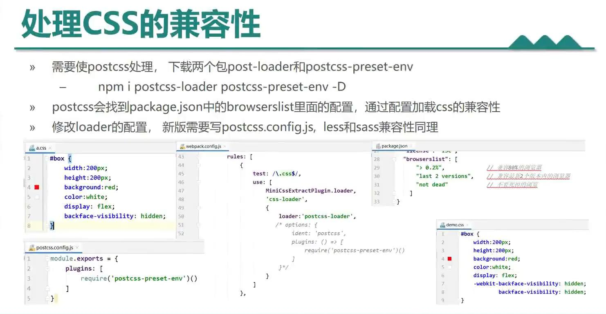
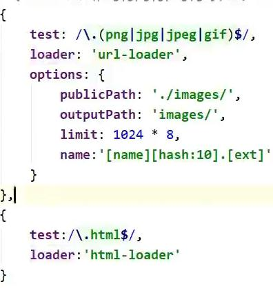
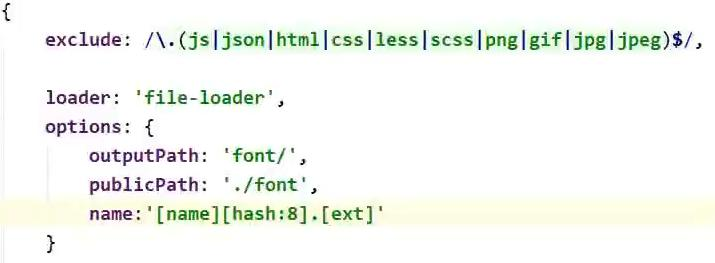
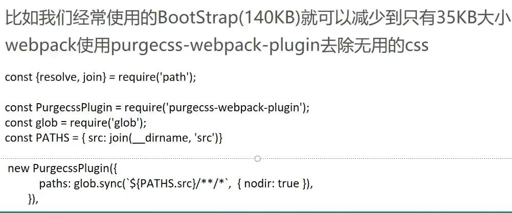

# Webpack v5.x  

## 初始体验（开发环境初始）
+ 新建项目目录 webpack-demo
+ npm init --yes 初始化项目目录
+ npm i '包' -S (生产环境)  -D (开发环境)
+ npm i webpack webpack-cli -g   先在全局安装
+ npm i webpack webpack-cli -D    再在项目开发中安装（webpack-cli 可以命令行使用的）
+ 创建/src/index.js 主入口文件，以及一些其他的文件或者文件目录
+ 控制台命令行：
	- 开发环境： webpack --mode=development
	- 生产环境： webpack --mode=production
+ 可以使用node运行打包后的js文件，也可以在html中引入js文件使用

## webpack ：构建工具，静态资源打包器
+ 在webpack看来，前端所有的资源文件（js/css/json/img/less/...）都会作为模块处理。根据模块的依赖关系进行静态分析，（chunk）（块）打包生成对应的静态资源（bundle）(捆)


## Webpack五个核心概念
+ `Entry`：入口，指示Webpack以哪个文件为入口起点开始打包，分析构建内部依赖图。
+ `Output`：输出，指示Webpack打包后的资源bundle输出到哪里去，以及如何命名。
+ `Loader`：让Webpack能够去处理那些非JavaScript文件（webpack本身只理解javascript，只能处理js/json资源）
+ `Plugins`：插件可以用于执行范围更广的任务。插件的范围包括，从打包优化和压缩，一直到重新定义环境中的变量等。
+ `Mode`：指示webpack使用相应模式的配置。
	- 

## webpack.config.js核心配置  ---- 文件名默认为这个。命令行直接运行`webpack`即可。改名需指定
+ ```js
	const { resolve } = require('path')
	module.exports = {
	  // 1 入口
	  entry: './src/index.js',
	  // 2 输出
	  output: {
		filename: 'bundle.js',
		path: resolve(__dirname, 'built')
	  },
	  // 3 loader翻译官
	  module: {
	  },
	  // 4 插件
	  plugins: [
	  ],
	  // 5 mode模式  开发模式development 生产模式production
	  mode: 'development'
	}
	```
+ Entry
	- 单入口，使用字符串，指定一个入口文件，打包成一个chunk，输出一个bundle，chunk名称是默认（output设置）
	  `entry: './src/index.js',`
	- Array：多入口，写多个入口文件，所有入口形成一个chunk，输出一个bundle。名称默认	
	  `entry:["./src/index.js","./src/main.js"],`
	- Object: 多入口，写多个入口文件，每个入口文件形成一个chunk，每个chunk输出一个bundle。名称是键名。
	```js
	  entry:{
	     one:"./src/index.js",
	     two:"./src/main.js"
	   },
	   //  输出output里面需要设置 filename:'[name].js'   //上面就会输出 one.js  two.js
	```
	- 特殊用法：有几个入口文件就生成几个chunk和bundle.  名称是键名[name]
	```js
	 entry:{
	   one:['./src/main.js','./src/index.js'],
	   two:'./src/main.js'
	 }
	```
	
	
## webpack打包html资源 (plugins)
+ 使用[plugins]:安装插件：`npm i html-webpack-plugin -D`
+ 引用插件：`const htmlWebpackPlugin = require('html-webpack-plugin')`
+ 在plugins里面：(使用多个实例打包多个html)
	```js
	plugins: [
	    // 默认会生成一个空的html，并且引入打包好的资源文件
	    // new htmlWebpackPlugin(),
	    // 通过参数指定内容
	    new htmlWebpackPlugin({
	      template: './src/index.html',
	      filename: 'demo.html'，
		  // chunks:['one','two'],    // 设置需要配合一起打包引入的资源项
		  // minify:{}
	    })
	  ],
	```
+ 当模式设置为`production`时候，会自动压缩
+ 如果是开发环境，可以手动设置压缩格式(谨慎使用)：
	```js
	minify:{
	        collapseWhitespace:true,   // 移除空格
	        removeComments:true    // 移除注释
	      }
	```
	
## webpack打包css资源（loader）
+ 下载需要使用的两个loader：`css-loader` `style-loader`
+ `css-loader`：处理css中的@import和url这样的外部资源（转换成js文件） 
+ `style-loader`：把样式插入到DOM中，再head里面插入一个style标签，并写入样式（在页面上可看到）
+ 使用：
	```js
	 module: {
	    rules: [
	      {
	        test: /\.css$/,
	        use: [ 'style-loader','css-loader']
	        // 使用顺序是从后往前的（顺序问题）
	        // css-loader 
	        // style-loader
	      }
	    ]
	  },
	```

## webpack打包less、sass资源（css预处理器->可编译为css）
+ 内联形式
	+ less需要less包和less-loader包 `npm i less less-loader -D`
	+ sass需要sass包和sass-loader包 `npm i sass sass-loader -D`
	+ ```js
	// // 打包翻译less
    // { test: /\.less$/, use: ['style-loader', 'css-loader','less-loader'] },
    // // 打包翻译sass（后缀名是scss）
    // { test: /\.scss$/, use: ['style-loader', 'css-loader','sass-loader'] },
	```
+ 将css提取为单独文件（使用plugins）,以文件形式引入
	- 下载插件：`npm i mini-css-extract-plugin -D`
	- 在配置文件中引入插件`const miniCssExtractPlugin = require('mini-css-extract-plugin')`
	- 在plugins模块中使用插件`new miniCssExtractPlugin()`  --可以添加参数filename重新命名
	- 将loader模块中将css的rules中的`style-loader`替换成`{ test: /\.css$/, use: [miniCssExtractPlugin.loader, 'css-loader'] }`
	- 同样，对于less和sass文件都按照上面进行替换即可。注意： 将所有css提取到一个文件中，不能分成多个文件
+ 处理css兼容性
	- 
+ 压缩css (开发时候最好不用，上线生产的时候使用)
	- 下载插件`npm i optimize-css-assetes-webpack-plugin -D`
	- 引用插件`const optimizeCssAssetesWebpackPlugin = require('optimize-css-assetes-webpack-plugi')`
	- 使用插件`plugins:[new optimizeCssAssetesWebpackPlugin()]`

## webpack打包图片资源
+ 下载loader：`url-loader`和`file-loader` 依赖关系 `npm i url-loader file-loader -D`  这是用来打包css中图片的
+ 下载loader：`html-loader`  专门用来打包html中图片的
+ 图片在html中使用和css中使用是不一样的打包方式
	- 

## webpack打包其他资源 
+ 

## webpack配置开发服务器devServer
+ 下载`npm webpack-dev-server -D`
+ 在webpack.config.js下配置：
+ ```js
	// 在webpack5中需要指明运行环境，才会进行自动刷新
	  target: "web",
	  devServer: {
		// 告诉开发服务器从哪儿寻找文件（Output）
		contentBase: resolve(__dirname, 'built'),
		// 端口
		port: 3000,
		// 启动gzip压缩
		compress: true,
		// 自动打开浏览器
		open: true,
	  },
	```
+ 在pacakge.json文件中设置启动脚本：
	+ ```js
		"dev": "webpack serve --mode=development",
		"built": "webpack --model=production"
		```
	- 注意：在webpack5中不能使用webpack-dev-server启动。使用`webpack serve`来启动。[详情](https://blog.csdn.net/xiaolongbaobushibao/article/details/113390838?ops_request_misc=%257B%2522request%255Fid%2522%253A%2522161484107116780266275175%2522%252C%2522scm%2522%253A%252220140713.130102334.pc%255Fblog.%2522%257D&request_id=161484107116780266275175&biz_id=0&utm_medium=distribute.pc_search_result.none-task-blog-2~blog~first_rank_v1~rank_blog_v1-1-113390838.pc_v1_rank_blog_v1&utm_term=webpack%E4%B8%8Ewebpack-dev-server%E7%89%88%E6%9C%AC%E4%B8%8D%E5%8C%B9)

## 环境优化
+ 开发环境的优化：1、打包构建速度 2、优化代码调试
+ 生产环境的优化：代码运行的性能
+ 模块热替换（HMR）：允许在运行时更新各种模块，而无需进行完全刷新。HMR 不适用于生产环境，这意味着它应当只在开发环境使用。
	- 开启：在配置文件中devServer中，调用`hot:true` ======开发环境中也可以不用这个。有一些异议
+ webpack通过tree shaking去掉了实际上没有使用的js代码来减少包大小
	+ tree shaking：树摇。 条件：1 ES6模块语法 2 在生产模式下	
+ 去除没有用到的CSS
	- 