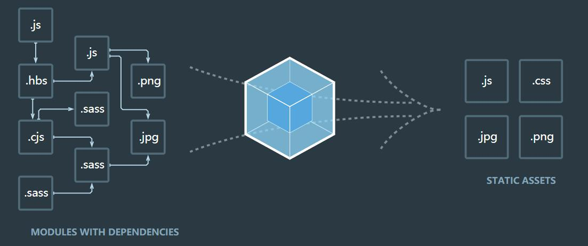

<svg t="1617184295766" class="icon" viewBox="0 0 1024 1024" version="1.1" xmlns="http://www.w3.org/2000/svg" p-id="2300" width="200" height="200"><path d="M826.709333 682.154667l-328.874666 189.866666-328.917334-189.866666v-379.733334l328.917334-189.909333 328.874666 189.866667z" fill="#FFFFFF" fill-opacity=".785" p-id="2301"></path><path d="M524.202667 84.48c-8.96 0-17.493333 2.517333-24.32 7.637333l-337.066667 189.44c-13.653333 7.253333-22.613333 21.333333-22.613333 37.546667v384c0 16.213333 8.96 30.336 22.613333 37.589333l337.066667 189.44c6.826667 5.12 15.36 7.68 24.32 7.68s17.493333-2.56 24.32-7.68l337.066666-189.44c13.653333-7.253333 22.613333-21.333333 22.613334-37.546666v-384c0-16.213333-8.96-30.378667-22.613334-37.632l-337.066666-189.44a40.32 40.32 0 0 0-24.32-7.637334z m0 91.733333l298.666666 168.106667v89.728h-0.682666v220.885333h0.682666v23.04l-298.666666 168.064-298.666667-168.106666V344.32l298.666667-168.106667z m0 88.746667l-209.066667 120.746667 209.066667 120.746666 209.066666-120.746666-209.066666-120.746667z m-213.333334 216.746667v152.746666l170.666667 98.517334v-152.746667l-170.666667-98.56z m426.666667 0l-170.666667 98.474666v152.746667l170.666667-98.474667v-152.746666z" fill="#8ED6FB" p-id="2302"></path><path d="M524.202667 264.96l-209.066667 120.746667 209.066667 120.746666 209.066666-120.746666-209.066666-120.746667z m-213.333334 216.746667v152.746666l170.666667 98.517334v-152.746667l-170.666667-98.56z m426.666667 0l-170.666667 98.474666v152.746667l170.666667-98.474667v-152.746666z" fill="#1C78C0" p-id="2303"></path></svg> 
# Webpack v5.x  
## 初始体验（开发环境初始）
+ 新建项目目录 webpack-demo
+ npm init --yes 初始化项目目录
+ npm i '包' -S (生产环境)  -D (开发环境)
+ npm i webpack webpack-cli -g   先在全局安装
+ npm i webpack webpack-cli -D    再在项目开发中安装（webpack-cli 可以命令行使用的）
+ 创建/src/index.js 主入口文件，以及一些其他的文件或者文件目录
+ 控制台命令行：
	- 开发环境： webpack --mode=development
	- 生产环境： webpack --mode=production
+ 可以使用node运行打包后的js文件，也可以在html中引入js文件使用

## webpack ：构建工具，静态资源打包器
+ 在webpack看来，前端所有的资源文件（js/css/json/img/less/...）都会作为模块处理。根据模块的依赖关系进行静态分析，（chunk）（块）打包生成对应的静态资源（bundle）(捆)


## Webpack五个核心概念
+ `Entry`：入口，指示Webpack以哪个文件为入口起点开始打包，分析构建内部依赖图。
+ `Output`：输出，指示Webpack打包后的资源bundle输出到哪里去，以及如何命名。
+ `Loader`：让Webpack能够去处理那些非JavaScript文件（webpack本身只理解javascript，只能处理js/json资源）
+ `Plugins`：插件可以用于执行范围更广的任务。插件的范围包括，从打包优化和压缩，一直到重新定义环境中的变量等。
+ `Mode`：指示webpack使用相应模式的配置。
	- 

## webpack.config.js核心配置  ---- 文件名默认为这个。命令行直接运行`webpack`即可。改名需指定
+ ```js
	const { resolve } = require('path')
	module.exports = {
	  // 1 入口
	  entry: './src/index.js',
	  // 2 输出
	  output: {
		filename: 'bundle.js',
		path: resolve(__dirname, 'built')
	  },
	  // 3 loader翻译官
	  module: {
	  },
	  // 4 插件
	  plugins: [
	  ],
	  // 5 mode模式  开发模式development 生产模式production
	  mode: 'development'
	}
	```
+ Entry
	- 单入口，使用字符串，指定一个入口文件，打包成一个chunk，输出一个bundle，chunk名称是默认（output设置）
	  `entry: './src/index.js',`
	- Array：多入口，写多个入口文件，所有入口形成一个chunk，输出一个bundle。名称默认	
	  `entry:["./src/index.js","./src/main.js"],`
	- Object: 多入口，写多个入口文件，每个入口文件形成一个chunk，每个chunk输出一个bundle。名称是键名。
	```js
	  entry:{
	     one:"./src/index.js",
	     two:"./src/main.js"
	   },
	   //  输出output里面需要设置 filename:'[name].js'   //上面就会输出 one.js  two.js
	```
	- 特殊用法：有几个入口文件就生成几个chunk和bundle.  名称是键名[name]
	```js
	 entry:{
	   one:['./src/main.js','./src/index.js'],
	   two:'./src/main.js'
	 }
	```
	
	
## webpack打包html资源 (plugins)
+ 使用[plugins]:安装插件：`npm i html-webpack-plugin -D`
+ 引用插件：`const htmlWebpackPlugin = require('html-webpack-plugin')`
+ 在plugins里面：(使用多个实例打包多个html)
	```js
	plugins: [
	    // 默认会生成一个空的html，并且引入打包好的资源文件
	    // new htmlWebpackPlugin(),
	    // 通过参数指定内容
	    new htmlWebpackPlugin({
	      template: './src/index.html',
	      filename: 'demo.html'，
		  // chunks:['one','two'],    // 设置需要配合一起打包引入的资源项
		  // minify:{}
	    })
	  ],
	```
+ 当模式设置为`production`时候，会自动压缩
+ 如果是开发环境，可以手动设置压缩格式(谨慎使用)：
	```js
	minify:{
	        collapseWhitespace:true,   // 移除空格
	        removeComments:true    // 移除注释
	      }
	```
	
## webpack打包css资源（loader）
+ 下载需要使用的两个loader：`css-loader` `style-loader`
+ `css-loader`：处理css中的@import和url这样的外部资源（转换成js文件） 
+ `style-loader`：把样式插入到DOM中，再head里面插入一个style标签，并写入样式（在页面上可看到）
+ 使用：
	```js
	 module: {
	    rules: [
	      {
	        test: /\.css$/,
	        use: [ 'style-loader','css-loader']
	        // 使用顺序是从后往前的（顺序问题）
	        // css-loader 
	        // style-loader
	      }
	    ]
	  },
	```

## webpack打包less、sass资源（css预处理器->可编译为css）
+ 内联形式
	+ less需要less包和less-loader包 `npm i less less-loader -D`
	+ sass需要sass包和sass-loader包 `npm i sass sass-loader -D`
	+ ```js
	// // 打包翻译less
    // { test: /\.less$/, use: ['style-loader', 'css-loader','less-loader'] },
    // // 打包翻译sass（后缀名是scss）
    // { test: /\.scss$/, use: ['style-loader', 'css-loader','sass-loader'] },
	```
+ 将css提取为单独文件（使用plugins）,以文件形式引入
	- 下载插件：`npm i mini-css-extract-plugin -D`
	- 在配置文件中引入插件`const miniCssExtractPlugin = require('mini-css-extract-plugin')`
	- 在plugins模块中使用插件`new miniCssExtractPlugin()`  --可以添加参数filename重新命名
	- 将loader模块中将css的rules中的`style-loader`替换成`{ test: /\.css$/, use: [miniCssExtractPlugin.loader, 'css-loader'] }`
	- 同样，对于less和sass文件都按照上面进行替换即可。注意： 将所有css提取到一个文件中，不能分成多个文件
+ 处理css兼容性
	- 
+ 压缩css (开发时候最好不用，上线生产的时候使用)
	- 下载插件`npm i optimize-css-assetes-webpack-plugin -D`
	- 引用插件`const optimizeCssAssetesWebpackPlugin = require('optimize-css-assetes-webpack-plugi')`
	- 使用插件`plugins:[new optimizeCssAssetesWebpackPlugin()]`

## webpack打包图片资源
+ 下载loader：`url-loader`和`file-loader` 依赖关系 `npm i url-loader file-loader -D`  这是用来打包css中图片的
+ 下载loader：`html-loader`  专门用来打包html中图片的
+ 图片在html中使用和css中使用是不一样的打包方式
	- 

## webpack打包其他资源 
+ 